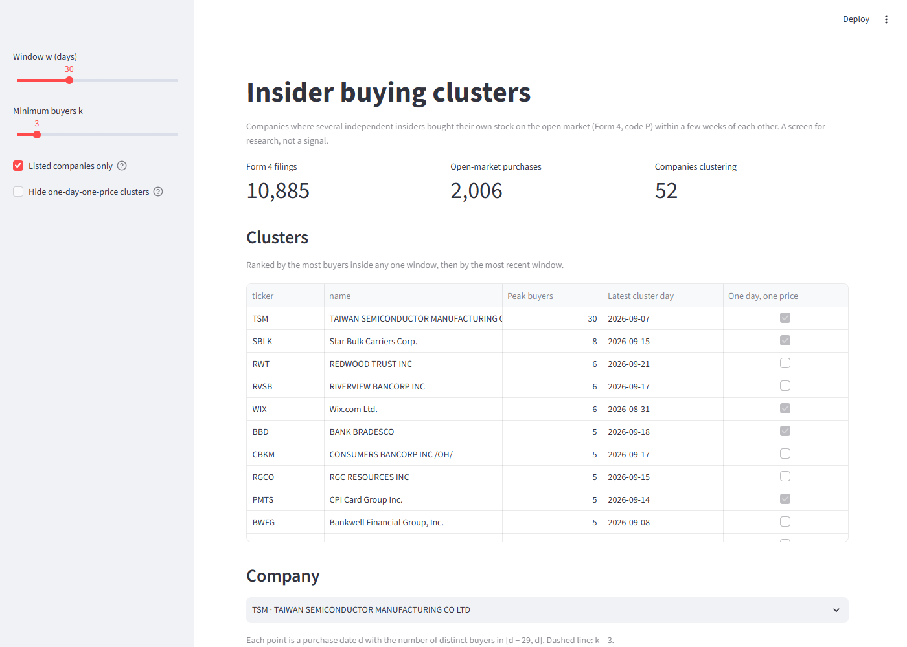

# glowing-octo-adventure: insider buying clusters



## What I built and who for

The SEC is the US market regulator. It requires company insiders (officers, directors and major shareholders) to report their trades on a Form 4, which it publishes through its EDGAR filing system. Over a chosen time window, this project retrieves every Form 4, cleans it into a small data model, and finds companies where several independent insiders bought shares on the open market within a few weeks of each other.

It is for a retail trader who wants a short list of companies worth researching this week. Insiders sell for many reasons (tax, diversification, a house), but they buy on the open market for mostly one reason: they think the stock is cheap. One insider buying is noise; several unrelated insiders buying in the same few weeks is worth a look. The tool is a screen that shrinks thousands of filings to a few dozen companies.

## The data

- **Source:** SEC EDGAR, Form 4 and 4/A filings. Free, no API key, public domain. The SEC asks for a `User-Agent` with a name and email, and at most 10 requests per second.
- **Discovery:** the EDGAR daily index (`master.YYYYMMDD.idx`) lists every filing made on a day. I keep the Form 4 rows and download each filing's full `.txt` submission.
- **What is committed:** every Form 4 filed on the 20 business days from 2026-08-24 to 2026-09-21: 10,885 filings (176 MB) in `data/raw/{accession}.txt`, byte for byte as the SEC returned them (`.gitattributes` stops git converting line endings).
- **After the build:** 10,885 filings, 11,898 filing–owner rows, 26,202 transaction lines, 2,605 companies, 8,699 insiders, 2,006 open-market purchases.

What makes it messy:

| Mess | What I did |
|---|---|
| A missing daily index (weekend, holiday) returns 403, the same code as being blocked | Ask the quarter folder's `index.json` which days exist first |
| Each filing appears in the index once per party (issuer and each owner) | Keep one row per accession |
| The XML nests most values in `<value>` tags; booleans are spelled `1/0/true/false`; empty tags mean "missing" | One reader per type, each returns a value or raises `ParseError`, never a guess |
| 3 filings omit the transaction code on some lines | `code` is nullable; a line with no code can't be a purchase |
| A filing can name several owners (a fund and its manager) | Owners named on the same filing count as one buyer (see below) |
| Filings disagree about a company's name or ticker (26 × RVSB vs 1 × RSVB) | Each CIK takes the value most of its filings give |
| Late filings report trades back to 2006 | Cluster on trade date, not filing date |
| Tickers can be `NONE` or `N/A` (private funds) | Kept in the data, hidden by default in the dashboard |

Things I take for granted: transaction code **P** means the insider bought shares on the open market (as opposed to receiving them as pay, exercising options, or a gift). Only P lines count as purchases.

## How it works

```
extract.py            build.py                                                     app.py
EDGAR ──fetch──▶ data/raw/*.txt ──parse──▶ facts ──▶ derived ──▶ clusters(w, k) ──▶ dashboard
                 (raw, committed)          sql/facts.sql  sql/derived.sql  sql/clusters.sql
```

Each file starts with a short model (sets and typed functions), and the code follows it name for name.

1. **Extract** (`extract.py`). `extract(days)` downloads every Form 4 filed on those days that isn't already on disk. It is safe to re-run: existing files are skipped, and each file is written to a `.part` file and renamed, so a crash never leaves a half-saved filing. Requests are spaced 0.2 s apart and retried with backoff on 429/5xx.
2. **Parse** (`parse.py`). Cuts the `<XML>` block out of each `.txt` and turns it into typed rows: one `Filing`, one `Owner` per reporting owner, one `Line` per transaction. Quantities are exact `Decimal`s, and missing stays `None`, never 0.
3. **Build** (`build.py`). Starts from an empty DuckDB file every time, so the database is a pure function of `data/raw`: building twice gives the same tables.
   - **Facts** (`sql/facts.sql`): `filings`, `owners`, `lines`, exactly what the filings say. Primary and foreign keys are declared, so the database rejects a duplicate or orphan row.
   - **Derived** (`sql/derived.sql`): `companies` and `insiders`, one name per CIK by majority rule, ties to the latest filing.
   - **Clusters** (`sql/clusters.sql`): the question.
4. **Dashboard** (`app.py`). Streamlit. Two sliders, `w` and `k`, feed the `clusters(w, k)` macro. Pick a company to see its buyer count over time and every purchase behind it. The dashboard only reads: every number on screen comes from a SQL macro.

**The cluster definition.** Owners named on one filing act together (a fund, its manager and its general partner file as one), so a *buyer* is a connected component of the graph "named on the same filing", computed with a recursive CTE. Then

- `buyers(c, d, w)` = number of distinct buyers of company `c`'s stock on days `d − w + 1` to `d`;
- `clusters(w, k)` = companies where `buyers(c, d, w) ≥ k` for some purchase date `d`, ranked by the largest count, then the most recent date.

The count can only rise on a purchase date, so checking those dates finds the maximum. With `w = 30`, `k = 3` there are 59 such companies (52 with a ticker).

**Flag, don't filter.** `one_day_one_price` marks clusters where every purchase has the same date and price. TSM's 30 "buyers" are 30 officers each buying about $4,000 of stock at $76.20 on 7 Sep: almost certainly a company-run plan, not 30 independent decisions. Bank Bradesco (5 officers, $17.98) is the same. The flag is shown and can be hidden; the trader decides.

**What the shape makes easy and hard.** Facts are kept apart from resolved values, so a new rule (say, for names) changes one SQL file and never the stored data. Keys make duplicates impossible rather than merely unlikely. The trade-off: a Form 4/A amendment doesn't say which filing it amends, so an amended trade can appear twice in the purchase list. The cluster count is safe from this: it counts distinct buyers, and a repeat from the same buyer never adds one.

## How to run it

Needs Python 3.12+ (the code uses `def f[T]` generics).

```bash
git clone https://github.com/KPS25FX/glowing-octo-adventure.git
cd glowing-octo-adventure
python -m venv .venv && source .venv/bin/activate   # Windows: .venv\Scripts\activate
pip install -r requirements.txt

streamlit run app.py        # builds insiders.duckdb from data/raw on first run (~15 s)
```

Other entry points:

```bash
python build.py                                             # rebuild insiders.duckdb from data/raw
python -c "import duckdb; print(duckdb.connect('insiders.duckdb').sql('SELECT * FROM clusters(30, 3)'))"
python extract.py 2026-09-22 2026-09-26 --user-agent "Your Name you@example.com"   # download more days
```

`notebooks/` holds the experiments I ran while learning the EDGAR format and `xml.etree`.

## What I would do next

- **Tests.** Property-based tests for the parser (`hypothesis`), a test that every raw file parses, a test that building twice gives equal tables, and tests of `clusters` on a small hand-made dataset.
- **10b5-1 plans.** Filings carry a flag for trades made under a pre-arranged plan. Those aren't a fresh decision, so they should count for less.
- **Amendments.** Match each 4/A to the filing it replaces so an amended trade is counted once.
- **Size and role.** Weight a purchase by its value and the buyer's role (a CEO's $1M buy says more than a director's $5k).
- **Surprise.** Compare a company's cluster with its own history: 3 buyers is unusual for some companies and routine for others.
- **Sector.** Each filing's header has the company's industry (SIC) code, which would allow filtering by sector.

## Where AI helped

- Generally speaking, I had Claude Code explain the idea behind the project. I did not know what data set to use, but I like trading-related things and most of all I like maths.
- I gave Claude a list of the general themes and ideas I've picked up during my degree that make code good, so I wouldn't lose them once I was focused on each feature. The code follows that list: a mathematical model at the top of each file, pure functions, one-way imports.
- Claude told me the syntax for libraries I had not used before, like `xml.etree` (`notebooks/Probe-ElementTree.ipynb` is me checking how it behaves).
- Claude gave me the URLs of the EDGAR filing system and the Form 4 filings, which I then used to fetch the data I needed.
- I designed the model with Claude and wrote the experiments(`index_url`, `fetch`) in `notebooks/Experiments-Extract.ipynb`. 
- **Kept:** treating co-filers as one buyer; the majority rule for names; flagging same-day, same-price clusters instead of deleting them.
- **Rejected:** an earlier version of this project with a watchlist and heavier statistics (topological clustering and surprise scores). 
